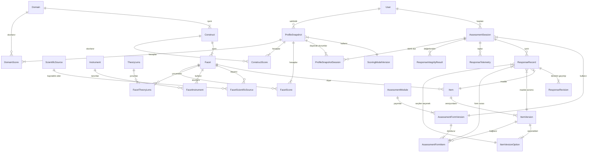

# 11. Veritabanı Mimarisi ve Psikolojik Veri Modeli

Bu doküman, PsycheAI Scientific Profile Engine Faz 1 kapsamında geliştirilen PostgreSQL veritabanı mimarisini, ilişkisel ontoloji modelini, versiyonlama stratejilerini ve bilimsel koruma kalkanlarını (guardrails) açıklar.

---

## 1. Mimari Prensipler

PsycheAI veri mimarisi dört temel bilimsel kural üzerine inşa edilmiştir:

1. **Ölçüm ile Yorumun Fiziksel Ayrımı:** Psikometrik skorlar (`FacetScore`, `ConstructScore`, `DomainScore`), LLM veya yapay zekâ yorumlarından bağımsız tablolarda saklanır. Puanlar salt matematiksel ve psikometrik fonksiyonlarla hesaplanır.
2. **Derin Madde ve Seçenek Versiyonlaması:** Bir anket maddesinin metni veya Likert etiketleri değiştiğinde mevcut kayıtlar bozulmaz; her madde sürümü (`ItemVersion`) kendi cevap seçeneklerini (`ItemVersionOption`) taşır.
3. **Dondurulmuş Değerlendirme Formları (Assessment Form Freeze):** Bir oturum başladığında belirli bir form sürümüne (`AssessmentFormVersion`) kilitlenir. Form maddeleri (`AssessmentFormItem`) o sürüm için sıralı ve dondurulmuştur.
4. **Ön Kalibrasyon Standartları (Pre-Calibration Guardrails):** Standart normlar toplanmadan önce (`NormVersion.status = 'UNAVAILABLE'`), skor kayıtlarında `standardError`, `ci95Lower`, `ci95Upper` ve `normVersionId` alanları kesinlikle `NULL` bırakılır. Nüfus yüzdelikleri (percentile) ve T-skorları üretilmez.

---

## 2. İlişkisel Varlık Modeli (Mermaid ER Diyagramı)

---

## 3. Tablo Yapıları ve Sorumlulukları

### 3.1. Kimlik ve Oturum
- **`users`:** Sistem kullanıcısını ve demo durumunu (`isDemoUser`) tutar.
- **`assessment_sessions`:** Belirli bir `formVersionId`'ye kilitlenen oturum kaydı. `status` (`IN_PROGRESS`, `PAUSED`, `COMPLETED`, `ABANDONED`) ve `currentStep` bilgisini yönetir.

### 3.2. Psikolojik Ontoloji
- **`domains`:** 9 temel psikolojik alan (HEXACO Temel Kişilik, Benlik & Öz-Düzenleme, Duygusal & Duygulanımsal, vb.).
- **`constructs`:** 30 psikolojik yapı.
- **`facets`:** 84 ölçülebilir alt boyut.
- **`scientific_sources`**, **`instruments`**, **`theory_lenses`**: Bilimsel kaynak, lisans onay kararı (`approved`, `requires_license`, `rejected`) ve teorik mercek bağlantıları.

### 3.3. Soru Bankası ve Dondurulmuş Formlar
- **`items`:** Madde kodu, ters puanlama (`isKeyed = false`) ve doğrulama sorusu (`isAttentionCheck = true`) bayrakları.
- **`item_versions`:** Türkçe/İngilizce soru metinleri ve doğrulama durumu (`validationStatus = "RESEARCH_DRAFT"`).
- **`item_version_options`:** Maddenin o sürümüne ait seçenek değerleri (1-5) ve metinleri.
- **`assessment_form_versions` & `assessment_form_items`:** Maddeleri belirli bir sıralamayla donduran form sürümleri (Örn: `v1.0.0`).

### 3.4. Yanıt Kayıtları ve Değişiklik Denetimi
- **`response_records`:** Kullanıcının form maddesine verdiği güncel cevap ve sunucu tarafında hesaplanmış ters-puanlanmış değeri (`scoredValue`).
- **`response_revisions`:** Kullanıcı bir sorunun cevabını değiştirdiğinde (`Geri` gidip yeniden işaretlediğinde) önceki değerleri kaybetmeyen değişmez sıra günlüğü (`sequence`, `rawValue`, `durationMs`, `changedAt`).
- **`response_telemetry`:** İstemci tarafından gözlemlenen yanıt süresi (`clientObservedDurationMs`), odak kaybı sayısı (`focusLostCount`) ve sunucu teslim zamanı (`serverReceivedAt`).
- **`response_integrity_results`:** Hızlı yanıtlama (<1200ms), düz yanıtlama (straightlining) ve dikkat kontrolü analizi.

### 3.5. Profil Snapshots ve Skorlar
- **`profile_snapshots`:** Oturum tamamlandığında oluşturulan dondurulmuş boylamsal profil.
- **`facet_scores`, `construct_scores`, `domain_scores`:** Aritmetik ham ortalamalar. `standardError` ve `ci95` alanları ön kalibrasyon aşamasında kesinlikle `NULL` değerindedir.
