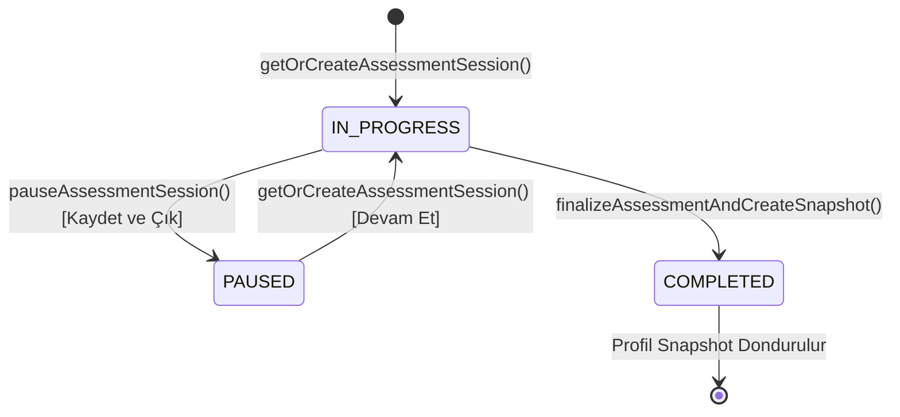

# 12. Değerlendirme Çalışma Zamanı (Assessment Runtime) ve Güvenilirlik Mimarisi

Bu doküman, PsycheAI platformunun değerlendirme oturumu yaşam döngüsünü, dondurulmuş form sürümü işleyişini, cevap denetim geçmişini, telemetri değerlendirme motorunu ve puanlama güvenliğini açıklar.

---

## 1. Oturum Yaşam Döngüsü (Session Lifecycle)

1. **Başlatma / Sürdürme:** Kullanıcı değerlendirmeye girdiğinde, belirtilen modüle ait yayımlanmış en güncel dondurulmuş form sürümü (`v1.0.0`) bulunur. Kullanıcının devam eden bir oturumu varsa (`IN_PROGRESS` veya `PAUSED`), aynı oturum kaldığı soru adımından (`currentStep`) devam ettirilir.
2. **Cevap Kaydı ve Değişiklik:** Kullanıcı bir seçeneği işaretlediğinde `submitResponseAction` çağrılır.
3. **Duraklatma (Kaydet ve Çık):** Kullanıcı oturumu istediği an dondurabilir (`status = 'PAUSED'`).
4. **Tamamlama ve Dondurma:** Son soruda "Değerlendirmeyi Tamamla" tetiklendiğinde oturum atomik bir veritabanı transaction'ı içerisinde sonlandırılır (`status = 'COMPLETED'`). Aynı oturumun ikinci kez tamamlanması ("double finalization") engellenir.

---

## 2. Dondurulmuş Form Sürümü (Assessment Form Freeze)

Bir değerlendirme oturumu başlatıldığında form maddeleri dinamik olarak sorgulanmaz:
- Oturum doğrudan `AssessmentFormVersion` kimliğine bağlanır.
- Form içindeki maddeler (`AssessmentFormItem`) belirli bir sıralama (`sortOrder: 1..N`) ve belirli bir madde sürümüne (`ItemVersion`) kilitlenmiştir.
- Gelecekte soru bankasına yeni sorular eklenmesi veya mevcut soruların metninin revize edilmesi, tamamlanmış veya devam eden oturumları etkilemez.

---

## 3. Güvenlik ve Sunucu Taraflı Ters Puanlama

- **İstemci Güven Sınırı:** İstemci (tarayıcı) sunucuya yalnızca `formItemId`, `selectedOptionVersionId`, `rawValue` (1-5), `durationMs` ve `focusLostCount` gönderebilir.
- **Zod Strict Modu:** Server Action katmanında `.strict()` doğrulaması uygulanır. İstemcinin `scoredValue`, `standardError`, `percentile` gibi puanlama alanlarını enjekte etme girişimleri anında reddedilir.
- **Ters Puanlama Algoritması:** Sunucu, maddenin `isKeyed` niteliğini inceler:
  - Düz kodlanmış maddelerde (`isKeyed = true`): `scoredValue = rawValue`
  - Ters kodlanmış maddelerde (`isKeyed = false`): `scoredValue = (min + max) - rawValue = 6 - rawValue` (Örn: 5 seçilirse 1, 1 seçilirse 5 olarak puanlanır).

---

## 4. Değişiklik Denetim Günlüğü (Response Revision History)

Kullanıcı `Geri` butonuna basıp daha önce işaretlediği bir sorunun cevabını değiştirdiğinde:
- `ResponseRecord` tablosundaki güncel değer ve `revisionCount` güncellenir.
- Eski cevap silinmez; `ResponseRevision` tablosuna değişmez bir kayıt eklenir (`sequence`, `rawValue`, `selectedOptionVersionId`, `durationMs`, `changedAt`).
- Bu sayede psikometrik araştırmacılar karar değiştirme dinamiklerini boylamsal olarak analiz edebilir.

---

## 5. Cevap Bütünlüğü ve Telemetri Motoru (Response Integrity Engine)

Her oturum sonlandırılırken `evaluateSessionIntegrity` fonksiyonu çalıştırılır:

1. **Hızlı Yanıtlama İhlali (Speed Violation):** Psikolojik bir madde metninin okunması ve bilişsel olarak değerlendirilmesi için asgari eşik **1200 milisaniye** (1.2 saniye) olarak belirlenmiştir. Bu sürenin altındaki yanıtlar dikkatsiz veya rastgele tıklama riski taşır.
2. **Düz Yanıtlama (Straightlining):** Ardışık olarak aynı seçeneğin (örn. üst üste 8 kez "3 - Kararsızım") işaretlenmesi tespit edilir.
3. **Doğrulama Sorusu (Attention Check):** Form içerisine gizlenmiş yönerge maddeleri (örn. "Veri kalitesini teyit etmek için lütfen 'Katılıyorum' seçeneğini işaretleyiniz") kontrol edilir. Yanlış yanıt verilmesi durumunda oturum `COMPROMISED` olarak bayraklanır.
4. **Bütünlük Bayrakları:** `EXCELLENT`, `ACCEPTABLE`, `QUESTIONABLE`, `COMPROMISED`.

---

## 6. Ön Kalibrasyon Puanlama Modeli

- Model Kodu: `PRE_CALIBRATION_MEAN_V1`
- Algoritma: `UNWEIGHTED_COMPOSITE_MEAN`
- Puanlama Hiyerarşisi:
  $$\text{Facet Score} = \frac{1}{N_{\text{items}}} \sum \text{scoredValue}$$
  $$\text{Construct Score} = \frac{1}{N_{\text{facets}}} \sum \text{Facet Score}$$
  $$\text{Domain Score} = \frac{1}{N_{\text{constructs}}} \sum \text{Construct Score}$$
- **Bilimsel Sınır:** Bu aşamada nüfus normları toplanmadığı için (`normStatus = 'UNAVAILABLE'`), standart hata ve %95 güven aralıkları raporda yer almaz (`standardError = NULL`, `ci95 = NULL`). "Türkiye'nin %80'inden yüksek" gibi temelsiz iddialar kesinlikle üretilmez.
