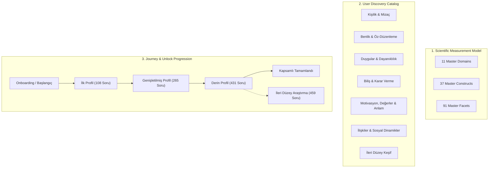

# PsycheAI — Comprehensive Assessment System & User Journey Specification
**FAZ 2.16 Architectural & Product Documentation**
**Version:** 2.16.0
**Date:** September 2026

---

## 1. Overview & Core Philosophy

PsycheAI's assessment system is built around a non-negotiable scientific principle:
> **Measurement coverage across the full 11-Domain, 37-Construct, 91-Facet Master Model is paramount.**
> Question count is an output of psychometric validity, never an arbitrary ceiling. Cognitive burden is addressed through modular user journeys, asynchronous multi-session save/resume, and progressive profile unlocks—never by omitting psychological constructs or compromising psychometric reliability.

---

## 2. Strict Architectural Separation

To guarantee scientific rigor alongside an intuitive, user-friendly experience, the system strictly separates three distinct concepts:

1. **Scientific Measurement Model:** 11 domains, 37 constructs, 91 facets mapped to validated empirical psychometric instruments.
2. **Product Discovery Catalog:** 7 intuitive consumer categories grouping assessments logically without mutating the underlying ontology.
3. **Journey Stages & Unlocks:** Clear stage progression allowing users to complete modules in bite-sized sessions with progressive depth unlocks.

---

## 3. The 16-Module Assessment Portfolio

| # | Assessment Code | Module Title (TR) | Primary Domain | Planned Items | Est. Time | Stage | Classification |
|---|---|---|---|:---:|:---:|:---:|:---:|
| 1 | `mod_core_hexaco_60` | Temel Kişilik Boyutları (HEXACO-60) | `core_personality` | 60 | ~12 dk | Core | **REQUIRED** |
| 2 | `mod_self_agency` | Benlik Sistemi ve Öz-Yetkinlik (RSES & GSE) | `self_system` | 20 | ~4 dk | Core | **REQUIRED** |
| 3 | `mod_emotion_regulation` | Duygu Düzenleme Stratejileri (ERQ) | `emotion_regulation` | 10 | ~2 dk | Core | **REQUIRED** |
| 4 | `mod_cognitive_epistemic` | Bilişsel ve Epistemik Yönelim (NFC-18) | `cognition_decision` | 18 | ~4 dk | Core | **REQUIRED** |
| 5 | `mod_volition_impulse` | İrade, Öz-Kontrol ve Dürtüsellik (BSCS & UPPS-P) | `self_regulation` | 33 | ~7 dk | Expansion | **RECOMMENDED** |
| 6 | `mod_basic_needs_sdt` | Temel Psikolojik İhtiyaçlar (BPNSFS) | `motivation_values` | 24 | ~5 dk | Expansion | **RECOMMENDED** |
| 7 | `mod_universal_values` | Evrensel İnsani Değerler (Schwartz PVQ-RR) | `motivation_values` | 50 | ~10 dk | Expansion | **RECOMMENDED** |
| 8 | `mod_relational_attachment_empathy` | İlişkisel Bağlanma ve Empati (ECR-R & IRI) | `social_relational` | 50 | ~10 dk | Expansion | **RECOMMENDED** |
| 9 | `mod_cognitive_adaptability` | Bilişsel Esneklik ve Belirsizlik Yönetimi (CFI & IUS-12) | `cognition_decision` | 32 | ~7 dk | Deep | **OPTIONAL** |
| 10 | `mod_meaning_compassion_grit` | Varoluşsal Anlam, Öz-Şefkat ve Sebat (MLQ, SCS, Grit) | `existential_meaning` | 30 | ~6 dk | Deep | **OPTIONAL** |
| 11 | `mod_conflict_boundaries` | Çatışma Yönetimi ve Kişisel Sınırlar (DUTCH-20) | `social_relational` | 20 | ~4.5 dk | Deep | **OPTIONAL** |
| 12 | `mod_affective_distress` | Duygulanım Dengesi ve Sıkıntı Toleransı (PANAS & DTS) | `emotion_regulation` | 35 | ~7.5 dk | Deep | **OPTIONAL** |
| 13 | `mod_flourishing_vitality` | Psikolojik Canlılık ve Yaşam Doyumu (FS & SWLS) | `wellbeing_vitality` | 13 | ~3 dk | Deep | **OPTIONAL** |
| 14 | `mod_coping_resilience` | Başa Çıkma Stratejileri ve Dayanıklılık (Brief-COPE & BRS) | `coping_resilience` | 20 | ~4.5 dk | Deep | **OPTIONAL** |
| 15 | `mod_creativity_growth` | Yaratıcı Zihniyet ve Epistemik Merak (5DCR & Mindset) | `creativity_curiosity` | 16 | ~3.5 dk | Deep | **OPTIONAL** |
| 16 | `mod_dark_tetrad_advanced` | Subklinik Kişilik Dinamikleri (SD4) | `optional_dark_tetrad` | 28 | ~6 dk | Advanced | **ADVANCED** |

---

## 4. Dynamic Question Budgets

Rather than hardcoded limits, stage question totals are computed dynamically from the registry:

- **Core Tier (First Profile):** 108 questions (4 modules, ~22.5 min)
- **Expansion Tier (Expanded Profile):** 265 cumulative questions (8 modules, ~54.5 min)
- **Comprehensive Consumer Tier:** 431 cumulative questions (15 consumer modules, ~90.5 min)
- **All Modules (including Dark Tetrad):** 459 cumulative questions (16 modules, ~96.5 min)

---

## 5. Multi-Instrument Container Independence

Multi-instrument containers (such as `mod_self_agency` containing RSES and GSE, or `mod_emotion_regulation` containing Cognitive Reappraisal and Expressive Suppression) strictly adhere to scientific measurement independence:
- **No fake composite totals:** Distinct constructs are scored independently on their native empirical scales (e.g. RSES 1.0–4.0, GSE 1.0–4.0, ERQ 1.0–7.0).
- **Quadrant & Spectrum Visualizations:** Specialized visual representations (e.g. ERQ Quadrant, Self-Worth vs Efficacy gauge) display subscales independently.

---

## 6. Profile Depth Modeling (Coverage Only)

Profile Depth is modeled purely as **Measurement Coverage**:
- Depth Levels: `BAŞLANGIÇ` $\rightarrow$ `TEMEL` $\rightarrow$ `GENİŞLETİLMİŞ` $\rightarrow$ `KAPSAMLI` $\rightarrow$ `İLERİ DÜZEY`
- It is **never** labeled as statistical confidence, diagnostic certainty, or percentile accuracy.
- Progress represents the percentage of the 91 master facets and planned questions answered.

---

## 7. Deterministic Next-Best-Assessment & Advisory Breaks

1. **Next Best Action Engine:**
   - Evaluates active user sessions and prioritization queue.
   - If an in-progress session exists, prioritizes resuming it (`ctaText = "Kaldığın Yerden Devam Et"`).
   - If no in-progress session exists, selects the highest priority not-started module in the current journey stage.
2. **Advisory Rest Notice (Non-blocking):**
   - After completing a module, the system suggests a 15–30 minute rest to preserve focus and response quality.
   - **No hard lockout:** Users can immediately proceed if they wish.

---

## 8. Legacy Form Isolation

Historical pre-calibration form records (`form_hexaco_v1_0_0`, 17 items) are classified as `LEGACY_PRECALIBRATION`. They are safely isolated from active 60-item forms, with clear provenance badges displayed in profile history.
