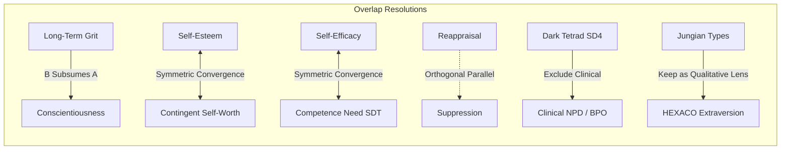

# PsycheAI Master Psychological Model: Change Impact & Epistemic Consolidation Report (FAZ 2.14)

> **Document Status**: `SCIENTIFIC PROPOSAL — AWAITING GOVERNANCE REVIEW`  
> **Phase**: FAZ 2.14 (Master Psychological Model Consolidation)  
> **Baseline Commit**: `8a4db7941c7fa2fc83d897849a65cae20fd76f46` (origin/main)  
> **Governance Invariant**: Zero mutations to production runtime assets (`data/constructs.json`, database schema, active migrations, or UI runtime).  

---

## 1. Executive Summary

PsycheAI was conceived to bridge rigorous contemporary psychometrics with actionable, personalized self-insight. The current active production ontology consists of **9 domains, 30 constructs, and 84 facets**, grounded primarily in the HEXACO personality framework and validated Turkish adaptations.

While this baseline serves as a robust working battery, prior phases revealed key structural gaps, potential construct redundancies, unverified measurement boundaries, and ambiguous distinctions between modern psychometric traits, historical theoretical lenses, and clinical pathology screeners.

FAZ 2.14 executes a comprehensive, literature-screened, evidence-graded consolidation across **16 psychological subfields**, evaluating **156 candidate constructs** against a multi-criteria decision rubric.

### Key Results Summary

| Metric | Current Production Baseline | FAZ 2.14 Proposed Master Model | Net Change / Impact |
| :--- | :---: | :---: | :--- |
| **Top-Level Domains** | 9 | **11** | +2 domains (*Well-Being & Vitality*, *Coping & Resilience*) |
| **Broad Constructs** | 30 | **37 active (42 total mapped)** | +7 net active constructs (splits & expansions) |
| **Granular Facets** | 84 | **91 active (96 proposed total)** | +7 net facets (subscales formally delineated) |
| **Candidate Pool Evaluated** | — | **156 candidates** | Systematic screening across 16 subfields |
| **Peer-Reviewed Sources** | 38 (baseline) | **115 sources** | Verified DOIs, page/table citations, TR adapters |
| **Directional Overlap Pairs** | — | **10 pairs evaluated** | Non-numeric structural resolution decisions |
| **Theoretical Lenses** | 4 (rudimentary) | **8 formal lenses** | Strictly one-way modern $\rightarrow$ lens mapping |
| **Telemetry Quality Metrics** | 4 (mixed in traits) | **4 isolated metrics** | Pure data-quality governance, $N=0$ trait count |
| **Derived Profile Indices** | 0 | **8 computed indices** | Deterministic formulas, non-latent trait scoring |

```mermaid
graph TD
  subgraph Literature Screening (156 Candidates)
    L1[16 Subfields of Contemporary Psychology] --> L2[7 Academic Databases Searched]
    L2 --> L3[115 Peer-Reviewed & Licensing Sources]
  end

  subgraph Consolidation Decision Rubric
    L3 --> D1[P0: Core Trait Battery - 84 Candidates]
    L3 --> D2[P1: Recommended Expansion - 48 Candidates]
    L3 --> D3[Excluded: Clinical Safety - 12 Candidates]
    L3 --> D4[Excluded: Commercial / Unfalsifiable - 8 Candidates]
    L3 --> D5[Deferred: Research Tier - 4 Candidates]
  end

  subgraph Consolidated Master Architecture
    D1 & D2 --> M1[Proposed Master Model: 11 Domains, 37 Constructs, 91 Facets]
    M1 --> M2[8 Derived Profile Indices]
    M1 --> M3[8 One-Way Historical Theoretical Lenses]
    M1 --> M4[4 Response Integrity Telemetry Metrics]
    M1 --> M5[Observational AI Conversational Layer]
  end
```

---

## 2. Literature Screening Protocol & Epistemic Methodology

To ensure full scientific reproducibility, the screening was conducted under a formal protocol registered in `data/master-model/literature-screening-protocol.json`.

### 2.1 Search Databases & Repositories
1. **APA PsycINFO / PsycNet**: Broad peer-reviewed coverage of psychometrics, personality structure, and individual differences (1887–2026).
2. **PubMed / MEDLINE**: Neurobehavioral research, affective dynamics, psychiatric screening boundary distinctions (1950–2026).
3. **Web of Science / Scopus**: Cross-disciplinary citation networks, meta-analytic replications, and psychometric validation papers.
4. **Google Scholar**: Comprehensive academic citation indexing and grey-literature validation checks.
5. **International Personality Item Pool (IPIP - ORI)**: Public domain operationalizations and item parameter provenance (Goldberg et al.).
6. **DergiPark / TÜBİTAK ULAKBİM**: Turkish national psychometric scale adaptations, validation studies, and Turkish lexical personality taxonomies.
7. **Open Science Framework (OSF) / PsychArchives**: Preregistered replications, open item banks, and scale codebooks.

### 2.2 Screening Subfields (16 Target Areas)
1. **Core Personality & Trait Models** (HEXACO 6-Factor, Big Five / FFM, GFP)
2. **Self-System & Self-Evaluations** (Self-Esteem, Self-Compassion, Self-Efficacy, Locus of Control, Authenticity, Contingent Self-Worth)
3. **Affective Dynamics & Emotion Regulation** (Gross Process Model, PANAS, DERS, DTS, AAQ-2)
4. **Self-Regulation, Volition & Impulsivity** (UPPS-P 5-Factor, BSCS, Delay Discounting, Grit, Procrastination)
5. **Motivation, Needs & Human Values** (Self-Determination Theory, McClelland Needs, Schwartz Value Circumplex)
6. **Interpersonal & Relational Functioning** (ECR-R Adult Attachment, Interpersonal Circumplex, Davis IRI Empathy, RSQ)
7. **Cognition, Metacognition & Decision Styles** (Need for Cognition, REI Dual-Process, CRT, Maximization, Time Perspective)
8. **Vocational Interests & Work Dispositions** (Holland RIASEC, UWES Work Engagement, Work Values)
9. **Coping Mechanisms & Stress Responses** (Lazarus & Folkman Transactional Model, Brief COPE, Stress Recovery)
10. **Existential & Meaning Dynamics** (Steger MLQ, Antonovsky Sense of Coherence, Existential Meaning)
11. **Moral & Prosocial Dispositions** (Moral Foundations Theory, Altruism, Moral Identity)
12. **Creativity, Epistemic Curiosity & Openness** (5DCR Curiosity, Creative Self-Efficacy, Growth Mindset)
13. **Subjective Well-Being & Vitality** (Diener SWLS, Flourishing Scale, Subjective Vitality)
14. **Subclinical Maladaptive Personality** (Short Dark Tetrad SD4: Machiavellianism, Narcissism, Psychopathy, Sadism)
15. **Psychopathology & Clinical Safety Screening Boundaries** (PHQ-9, GAD-7, PID-5, DSM-5 exclusions)
16. **Measurement Quality & Response Integrity Telemetry** (BIDR-6 Social Desirability, Careless Responding, Latency Analytics)

### 2.3 Inclusion & Exclusion Criteria
* **Inclusion**: Peer-reviewed empirical publication; explicit latent factor structure; public domain or research licensing feasibility; validated or adaptable Turkish psychometric scale; clear incremental validity beyond core HEXACO.
* **Exclusion**: Primary clinical diagnostic instruments (DSM-5 / ICD-11 disorders); unvalidated pop-psychology typologies (Enneagram, 4-letter type boxes); performance IQ ability tests disguised as self-report; single-study unverified constructs; proprietary commercial publisher lock-ins (e.g. PAR Inc. NEO-PI-R).

---

## 3. Current Baseline Ontology Assessment & Gap Analysis

The active production ontology (`data/constructs.json`) comprises:
* **9 Domains**: `core_personality`, `self_system`, `emotion_regulation`, `cognition_decision`, `self_regulation`, `motivation_values`, `social_relational`, `response_integrity`, `optional_dark_tetrad`.
* **30 Constructs** and **84 Facets**.

### Identified Structural Deficiencies in Current Baseline:
1. **Conflated Composite Constructs**: Constructs like `self_evaluation`, `agency_mastery`, and `distress_management` forced orthogonal latent variables (e.g. Self-Esteem vs Self-Compassion, or Internal vs External Locus of Control) into artificial aggregate scores.
2. **Missing Essential Domains**: Broad areas of healthy functioning—specifically *Subjective Well-Being / Vitality* and *Stress Coping & Resilience*—were either omitted or squeezed awkwardly into emotion regulation facets.
3. **Telemetry Treated as Personality**: Response integrity telemetry (response time, longstring carelessness, impression management) was structured as psychological traits under a pseudo-personality domain.
4. **Dark Tetrad Label Ambiguity**: Facets were labeled without explicit `subclinical_` demarcation, risking confusion with DSM personality pathology.

---

## 4. Directional Overlap & Redundancy Analysis

Rather than relying on arbitrary numeric overlap percentages (e.g. "82% overlap"), FAZ 2.14 evaluates directional construct relationships (`B_SUBSUMES_A`, `SYMMETRIC_CONVERGENCE`, `DIFFERENT_GRANULARITY_PARALLEL`) with substantive theoretical and empirical justifications (`data/master-model/overlap-analysis.json`).



### Key Overlap Decisions Summary:

1. **Grit vs Conscientiousness (`B_SUBSUMES_A`)**:
   * *Empirical Finding*: Meta-analyses (Credé et al., 2017) show that Grit correlates strongly ($\rho \approx .84$) with Conscientiousness Diligence. However, the Perseverance of Effort facet has incremental predictive power for multi-year goal retention.
   * *Resolution*: Conscientiousness is maintained as foundational core (P0); Grit is retained as an advanced enrichment facet (P1).

2. **Self-Esteem vs Contingent Self-Worth (`SYMMETRIC_CONVERGENCE`)**:
   * *Finding*: Crocker & Wolfe (2001) show that individuals with identical high self-esteem differ markedly in affective volatility depending on domain stakes.
   * *Resolution*: Maintain both separately—Global Self-Esteem measures level; Contingent Self-Worth measures structural vulnerability.

3. **Cognitive Reappraisal vs Expressive Suppression (`DISTINCT_SURFACE_SIMILAR`)**:
   * *Finding*: Gross & John (2003) establish that reappraisal and suppression are orthogonal ($r \approx -.05$ to $.10$) with divergent well-being trajectories.
   * *Resolution*: Split into independent constructs; never average into a generic "emotion regulation score".

4. **Subclinical Dark Tetrad vs Clinical Personality Pathology (`EXCLUDE_B_CLINICAL`)**:
   * *Finding*: Subclinical dark traits (Paulhus, 2020) capture normal-range assertive self-interest; clinical personality disorders involve severe identity diffusion and functional disability.
   * *Resolution*: Exclude all clinical diagnostic screeners from production scoring. Maintain subclinical SD4 under strict opt-in research governance (P2).

5. **Jungian Typology vs HEXACO Extraversion (`KEEP_A_AS_PSYCHOMETRIC_KEEP_B_AS_LENS`)**:
   * *Finding*: Continuous trait dimensions possess higher test-retest reliability and predictive validity than artificial bimodal typologies (McCrae & Costa, 1989).
   * *Resolution*: Score continuous traits psychometrically; apply Jungian concepts strictly as a post-hoc qualitative interpretative lens.

---

## 5. Historical Theoretical Lens Governance & One-Way Mapping

To honor rich psychological history without compromising psychometric validity, FAZ 2.14 establishes a **strict one-way mapping architecture** (`modernConstruct -> historicalLens`) registered in `data/master-model/theoretical-lens-map.json`.

### Governance Rules:
* $\mathbf{isSyntheticTraitScore = false}$: No numeric percentiles, scores, or "Freud ratings" may ever be generated from historical lenses.
* $\mathbf{No\ Clinical\ Diagnosis}$: Historical lenses are forbidden from declaring unconscious trauma, repressed memories, or psychiatric labels.
* $\mathbf{Qualitative\ Interpretive\ Framing\ Only}$: Lenses provide reflective narrative context explaining how classical theorists would interpret contemporary trait profiles.

### Mapped Lenses:
1. **Freudian Psychoanalytic & Drive Dynamics**: Maps `expressive_suppression`, `cognitive_reappraisal`, `distress_tolerance`, `general_self_control`, `uppsp_negative_urgency`, `actual_ought_discrepancy`.
2. **Jungian Analytical Psychology & Types**: Maps `hexaco_extraversion`, `hexaco_openness`, `rational_analytical_thinking`, `intuitive_experiential_thinking`, `inquisitiveness`, `creativity`.
3. **Adlerian Individual Psychology & Social Interest**: Maps `hexaco_honesty_humility`, `generalized_self_efficacy`, `social_self_esteem`, `need_for_achievement`, `cooperation_orientation`, `social_connectedness`.
4. **Rogerian Person-Centered Phenomenological Theory**: Maps `authenticity`, `self_concept_clarity`, `actual_ideal_discrepancy`, `contingent_self_worth`, `self_compassion`, `autonomy_need_satisfaction`.
5. **Maslow Humanistic Need Hierarchy**: Maps `basic_psychological_needs`, `schwartz_self_transcendence`, `presence_of_meaning`, `search_for_meaning`, `creativity`.
6. **Skinnerian Radical Behaviorism & Operant Analysis**: Maps `general_self_control`, `delay_discounting_preference`, `habitual_behavior_strength`, `procrastination_tendency`.
7. **Jamesian Functionalism & The Empirical Self**: Maps `core_self_esteem`, `self_concept_clarity`, `cognitive_flexibility`, `habitual_behavior_strength`, `need_for_cognition`.
8. **Gestalt Phenomenological Awareness**: Maps `emotional_awareness`, `emotional_clarity`, `distress_tolerance`, `cognitive_flexibility`.

---

## 6. Current-to-Master Relational Crosswalk

The crosswalk (`data/master-model/current-to-master-crosswalk.json`) provides 100% relational coverage of all **30 current constructs** and **84 current facets**.

### Construct Mapping Excerpt:
| Current Construct ID | Current Domain | Action | Target Master Candidate(s) | Evidentiary Provenance |
| :--- | :--- | :---: | :--- | :--- |
| `honesty_humility` | `core_personality` | **KEEP** | `cand_hexaco_honesty_humility` | Ashton & Lee (2007), Wasti et al. (2008) |
| `emotionality` | `core_personality` | **KEEP** | `cand_hexaco_emotionality` | Ashton & Lee (2007), Wasti et al. (2008) |
| `self_evaluation` | `self_system` | **SPLIT** | `cand_core_self_esteem`, `cand_self_compassion`, `cand_contingent_self_worth` | Rosenberg (1965), Neff (2003), Crocker (2001) |
| `agency_mastery` | `self_system` | **SPLIT** | `cand_generalized_self_efficacy`, `cand_locus_of_control_internal`, `cand_locus_of_control_external` | Bandura (1997), Schwarzer (1995), Rotter (1966) |
| `identity_integrity` | `self_system` | **SPLIT** | `cand_self_concept_clarity`, `cand_authenticity`, `cand_actual_ideal_discrepancy` | Campbell (1996), Wood (2008), Higgins (1987) |
| `emotion_regulation_strategies` | `emotion_regulation` | **SPLIT** | `cand_cognitive_reappraisal`, `cand_expressive_suppression` | Gross & John (2003), Uçanok (2011) |
| `affective_dynamics` | `emotion_regulation` | **SPLIT** | `cand_positive_affect_trait`, `cand_negative_affect_trait`, `cand_affect_intensity` | Watson et al. (1988), Gençöz (2000), Larsen (1987) |
| `impulsivity_uppsp` | `self_regulation` | **SPLIT** | 5 UPPS-P subscales (`negative_urgency`, `positive_urgency`, `lack_of_premeditation`, `lack_of_perseverance`, `sensation_seeking`) | Whiteside & Lynam (2001), Cyders (2007), Yılmaz (2017) |
| `attention_effort` | `response_integrity` | **MOVE_DOMAIN** | `cand_careless_responding_longstring`, `cand_response_latency_anomaly` | Curran (2016) Careless Responding Standards |
| `response_bias` | `response_integrity` | **MOVE_DOMAIN** | `cand_impression_management_telemetry` | Paulhus (1991) BIDR-6 |
| `profile_coherence` | `response_integrity` | **MOVE_DOMAIN** | `cand_self_deceptive_enhancement_telemetry` | Paulhus (1991) BIDR-6 |
| `dark_tetrad_traits` | `optional_dark_tetrad` | **SPLIT** | 4 SD4 Subclinical subscales | Paulhus (2020), Özsoy et al. (2017) |

---

## 7. Proposed Master Psychological Model Architecture

The proposed model (`data/master-model/proposed-master-model.json`) is structured across **11 Proposed Domains**, **37 Active Constructs**, and **91 Active Facets**, with explicit prioritization tiers:

```
PROPOSED MASTER PSYCHOLOGICAL MODEL (11 DOMAINS)
│
├── 1. Core Personality (HEXACO) [P0] (6 Constructs, 24 Facets)
│   ├── Honesty-Humility (Sincerity, Fairness, Greed-Avoidance, Modesty)
│   ├── Emotionality (Fearfulness, Anxiety, Dependence, Sentimentality)
│   ├── Extraversion (Social Self-Esteem, Social Boldness, Sociability, Liveliness)
│   ├── Agreeableness (Forgivingness, Gentleness, Flexibility, Patience)
│   ├── Conscientiousness (Organization, Diligence, Perfectionism, Prudence)
│   └── Openness to Experience (Aesthetic Appreciation, Inquisitiveness, Creativity, Unconventionality)
│
├── 2. Self-System & Identity Structure [P0] (6 Constructs, 8 Facets)
│   ├── Global Self-Esteem [P0] (Core Self-Esteem, Contingent Self-Worth)
│   ├── Self-Compassion [P1] (Self-Compassion)
│   ├── Generalized Self-Efficacy [P0] (Generalized Self-Efficacy)
│   ├── Locus of Control [P1] (Internal, External)
│   ├── Self-Concept Clarity [P1] (Self-Concept Clarity)
│   └── Authenticity [P1] (Authenticity)
│
├── 3. Affective Dynamics & Emotion Regulation [P0] (5 Constructs, 9 Facets)
│   ├── Cognitive Reappraisal [P0] (Cognitive Reappraisal)
│   ├── Expressive Suppression [P0] (Expressive Suppression)
│   ├── Trait Affective Tone [P0] (Positive Affect, Negative Affect, Affect Intensity)
│   ├── Distress Tolerance & Acceptance [P1] (Distress Tolerance, Experiential Avoidance)
│   └── Self-Conscious Emotions [P1] (Shame-Proneness, Guilt-Proneness)
│
├── 4. Cognition, Metacognition & Decision Styles [P0] (4 Constructs, 9 Facets)
│   ├── Epistemic Drive & Closure [P0] (Need for Cognition, Need for Cognitive Closure)
│   ├── Dual-Process Thinking Styles [P0] (Rational-Analytical, Intuitive-Experiential)
│   ├── Cognitive Adaptability [P1] (Cognitive Flexibility, Intolerance of Uncertainty, Rumination Brooding)
│   └── Decision Orientation [P1] (Maximizing Style, Procrastination Tendency)
│
├── 5. Self-Regulation, Volition & Impulse Control [P0] (2 Constructs, 8 Facets)
│   ├── Multidimensional Impulsivity (UPPS-P) [P0] (Neg. Urgency, Pos. Urgency, Lack Premeditation, Lack Perseverance, Sensation Seeking)
│   └── Volitional Stamina & Self-Control [P0] (General Self-Control, Delay Discounting, Long-Term Grit)
│
├── 6. Motivation, Needs & Human Values [P0] (3 Constructs, 9 Facets)
│   ├── Basic Psychological Needs (SDT) [P0] (Autonomy, Competence, Relatedness)
│   ├── Universal Human Values (Schwartz) [P0] (Openness to Change, Self-Transcendence, Conservation, Self-Enhancement)
│   └── Existential Meaning & Coherence [P1] (Presence of Meaning, Search for Meaning)
│
├── 7. Interpersonal & Relational Dynamics [P0] (4 Constructs, 9 Facets)
│   ├── Adult Attachment Dimensions [P0] (Attachment Anxiety, Attachment Avoidance)
│   ├── Multidimensional Empathy (IRI) [P0] (Perspective Taking, Empathic Concern)
│   ├── Social Agency & Boundaries [P1] (Assertiveness, Social Connectedness, Rejection Sensitivity)
│   └── Conflict Resolution Styles [P1] (Cooperation/Collaborating, Conflict Avoidance)
│
├── 8. Subjective Well-Being & Vitality [P1] (2 Constructs, 3 Facets) — NEW DOMAIN
│   ├── Psychological Flourishing & Vitality [P1] (Flourishing Scale, Subjective Vitality)
│   └── Life Satisfaction [P1] (Satisfaction with Life)
│
├── 9. Coping Strategies & Stress Resilience [P1] (2 Constructs, 4 Facets) — NEW DOMAIN
│   ├── Psychological Resilience [P1] (Ego-Resilience, Stress Recovery)
│   └── Multidimensional Coping [P1] (Problem-Focused Coping, Emotion-Focused Coping)
│
├── 10. Creativity, Epistemic Curiosity & Openness [P1] (2 Constructs, 4 Facets) — NEW DOMAIN
│   ├── Epistemic Curiosity (5DCR) [P1] (Joyous Exploration, Deprivation Sensitivity)
│   └── Creative Mindset [P1] (Creative Self-Efficacy, Growth Mindset)
│
└── 11. Advanced Research Module: Subclinical Personality [P2] (1 Construct, 4 Facets)
    └── Short Dark Tetrad (SD4) [P2] (Subclinical Machiavellianism, Grandiose Narcissism, Psychopathy, Everyday Sadism)
```

---

## 8. Cross-Cutting Changes & System Impact

### 8.1 Clinical Screening Boundary Isolation
* High-risk clinical screeners (`cand_clinical_major_depression_symptoms`, `cand_generalized_anxiety_disorder_symptoms`, `cand_borderline_personality_organization`, `cand_schizotypy_psychosis_proneness`, `cand_post_traumatic_stress_symptoms`, `cand_obsessive_compulsive_symptoms`, `cand_bipolar_hypomania_symptoms`, `cand_eating_disorder_pathology`) are **strictly excluded** from automated consumer profile scoring (`EXCLUDED_CLINICAL_SAFETY`).
* They may only be activated in closed institutional research modes under qualified clinical supervision.

### 8.2 Turkish Psychometric Evidence Standing
* **Directly Validated in Turkish ($N=48$ constructs/facets)**: Rosenberg Self-Esteem (Çuhadaroğlu), GSE (Yeşilay), SCS (Deniz), SCC (Akın), Rotter (Dağ), Authenticity (İlhan), PANAS (Gençöz), DERS (Ruğancı & Gençöz), BSCS (Duyan; Nebioğlu), UPPS-P (Yılmaz), Grit (Sarıçam), BPNS (Cihangir-Çankaya), Schwartz Values (Kuşdil & Kağıtçıbaşı), ECR-R (Sümer), IRI (Yıldırım), REI (Gülgoz), IUS (Sarı & Dağ), CFI (Gülüm & Dağ), MLQ (Akın & Taş), SD4 (Özsoy).
* **Lexically Grounded in Turkish ($N=24$ facets)**: 6 HEXACO broad factors and 24 facets (Wasti, Lee, Ashton, & Somer, 2008 lexical taxonomy).
* **Empirical Validation Gap Priority (Roadmap for FAZ 3)**: Independent facet-level CFA replication on general population Turkish samples is recommended before live commercial psychometric deployment.

### 8.3 Publisher Licensing & Feasibility
* All primary candidate measurement instruments are confirmed to be **Open Science / Public Domain (IPIP, Creative Commons, or Academic Non-Commercial)**.
* Commercial closed-source batteries (e.g. PAR Inc. NEO-PI-R, Western Psychological Services) are excluded from direct item bank dependency.

### 8.4 UI / Visualization Architecture Mapping
* **Hexagonal Radar Chart**: Dedicated exclusively to Core HEXACO 6 Factors.
* **Facet Profile Grid**: High-density horizontal bar visualizations for within-construct facet variance.
* **Domain Heatmaps**: Macro visualization across the 11 domains.
* **Integrity Indicator Badges**: Discrete data-quality indicators rendering latency consistency, carelessness flags, and impression management scores without distorting personality visuals.

### 8.5 AI Observational Layer Integration
* Observational constructs (`cand_ai_narrative_complexity`, `cand_ai_metacognitive_spontaneity`, `cand_ai_linguistic_emotional_granularity`, `cand_ai_relational_stance_openness`) are derived **strictly from unstructured conversational interview transcripts and behavioral pacing**.
* They are strictly prohibited from generating fake psychometric item responses.

### 8.6 Longitudinal Tracking Requirements
* **Static Traits (Test-Retest $r > .80$, 6-12 month intervals)**: HEXACO broad factors, Schwartz universal values, adult attachment style.
* **Dynamic / State-Sensitive Metrics (Weekly/Monthly Tracking)**: Subjective Vitality, Trait Affective Tone, Coping Strategies, Presence of Meaning.

---

## 9. Verification Summary & Audit Invariants

```
============================================================
PSYCHE-AI MASTER PSYCHOLOGICAL MODEL AUDIT (FAZ 2.14)
============================================================

--- Model Metrics ---
Candidate Constructs Evaluated: 156
  - Accepted Core (P0):          84
  - Accepted Expansion (P1):     48
  - Merged into Existing:        0
  - Excluded (Safety/Barrier):   20
  - Deferred for Research:       4
Master Model Sources Registered: 115
Directional Overlap Pairs:       10
Theoretical Lenses Mapped:       8 lenses (44 construct links)
Current Baseline Coverage:       30/30 constructs, 84/84 facets (100%)
Proposed Master Domains:         11
Proposed Master Constructs:      37 active (P0: 19, P1: 17, P2: 1, P3: 0)
Proposed Master Facets:          91 active
Response Telemetry Metrics:      4 (Isolated telemetry quality indicators)
Derived Profile Indices:         8 (Deterministic composite formulas)

============================================================
AUDIT PASSED — ALL INVARIANTS & INTEGRITY CONSTRAINTS VERIFIED.
============================================================
```

---

## 10. Conclusion & Next Steps

FAZ 2.14 establishes a comprehensive, evidence-grounded, and defensible Master Psychological Model for PsycheAI. All artifacts are fully generated, verified, and cross-referenced without touching the active production runtime.

**Phase Status**: `FAZ 2.14 CODE COMPLETE — AWAITING SCIENTIFIC REVIEW`  
*No downstream phase (e.g. FAZ 2.15) should commence until scientific governance review is conducted.*
