# PsycheAI — Master Product Experience Rebuild (v1.0)
**Tüketici Deneyimi, Katmanlı Profil Mimarisi ve Tüketici Dili Dönüşüm Raporu**

---

## 1. Yönetici Özeti & Dönüşüm Vizyonu

PsycheAI'ın mevcut bilimsel ve psikometrik altyapısı (11 Alan, 37 Yapı, 91 Alt Boyut, 469 Madde, 10 Kuram Merceği) son derece ileri ve deterministiktir. Ancak önceki tüketici arayüzü, geliştirici ve psikometri jargonu (`PROVISIONAL_POINT_ESTIMATE`, `Cronbach Alpha`, `MEASURED_PRECALIBRATION`, ham kodlar, uydurma norm yüzdeleri) ile doluydu.

Bu ana ürün deneyimi yeniden inşasıyla (Master Product Experience Rebuild):
1. **Tüketici Deneyimi Ön Plana Çıkarıldı:** Kullanıcının temel sorularına (*"Bu sonuç benim hakkımda ne söylüyor?", "Bu puan ne anlama geliyor?", "Günlük hayatımda nasıl görünüyor?", "Diğer özelliklerimle nasıl birleşiyor?"*) doğrudan yanıt veren sıcak, insani ve güçlendirici bir dil benimsendi.
2. **3 Katmanlı Kademeli Açılma (Progressive Disclosure):**
   - **Katman 1 (Beni Anla):** Başlıklar, özetler, öne çıkan eğilimler, günlük hayat yansımaları, düşünme soruları.
   - **Katman 2 (Profilimi Keşfet):** Boyut etkileşimleri, sinerjiler, hassas denge noktaları, 11-Alan Çarkı, Parmak İzi, Kuramsal Konsil.
   - **Katman 3 (Bilimsel Detay Çekmecesi):** Ölçüm maddesi sayısı, ham skor, ölçek konum aralığı, psikometrik açıklamalar ve güvenilirlik göstergeleri (isteğe bağlı ve katlanabilir).
3. **Bilimsel Değişmezler & Epistemik Güvenceler Korundu:**
   - AI asla psikometrik skor hesaplamaz.
   - Günlük kayıtları psikometrik ölçüm yerine geçmez.
   - Kuramsal ekoller skor üretemez; sadece ölçülmüş verilere epistemik mercek tutar.
   - Uydurma toplum normları (%98.4 güvenilirlik, Türk normu, yüzdelik dilimler) sunulmaz; 1–5 ölçek konumlandırması kullanılır.
   - Klinik teşhis veya patolojikleştirici dil kullanılmaz.

---

## 2. Mimari Katmanlar ve Yeniden İnşa Edilen Bileşenler

```mermaid
flowchart TD
    subgraph PUBLIC_LAYER["1. Halka Açık Alan & Onboarding"]
        Home["/ (Landing Page - Flagship Hero & Interactive Preview)"]
        Science["/science (Bilimsel Güvenceler & Epistemik Ayrım)"]
        How["/how-it-works (3 Katmanlı Model)"]
        Privacy["/privacy (AES-256 & Sıfır PII)"]
        Terms["/terms (Araştırma & Etik Sınırlar)"]
        Auth["/login & /register (50/50 Split Onboarding)"]
    end

    subgraph ACTION_LAYER["2. Eylem & Sonuç Deneyimi"]
        Overview["/overview (Şimdi Ne Yapmalıyım? & Aksiyon Dashboard)"]
        Assessment["/assessment (Temizlenmiş Test Deneyimi)"]
        ResultHero["ResultSummaryHero (6 Soruluk Yanıt Çerçevesi)"]
    end

    subgraph PROFILE_LAYER["3. Birleşik Profil IA (15 Bölüm)"]
        SummarySec["ProfileSummarySection (Seni En İyi Anlatanlar)"]
        Fingerprint["ProfileFingerprint (Polar Görsel İmza)"]
        DomainWheel["DomainWheel (11-Alan İnteraktif Keşif Çarkı)"]
        FacetExplorer["FacetExplorerV2 (91 Alt Boyut & 3 Katmanlı Kartlar)"]
        UnifiedProfile["UnifiedProfileClientViewV2 (15 Bölümlük Katmanlı IA)"]
    end

    subgraph THEORY_LAYER["4. Kuramsal Konsil & AI Derinliği"]
        CouncilLanding["TheoryCouncilLandingClient (10 Büyük Mercek)"]
        LensDetail["TheoryLensDetailClient & EpistemicBadge"]
        CompareDesk["TheoryComparisonClient (2-3 Ekol Karşılaştırma)"]
        AIDepth["AI Insight Engine V2.1 (GLANCE | NARRATIVE | DEEP_ANALYSIS)"]
    end

    PUBLIC_LAYER --> ACTION_LAYER
    ACTION_LAYER --> PROFILE_LAYER
    PROFILE_LAYER --> THEORY_LAYER
```

---

## 3. Yeniden İnşa Edilen Dosyaların Özeti

| Katman / Alan | Dosya Yolu | Temel Görev & Yapılan Değişiklik |
| :--- | :--- | :--- |
| **Dil & Terminoloji** | `src/lib/consumerLanguage.ts` | 5 ölçek konumu, durum çevirileri, nötr denge dili |
| **İkon Mimarisi** | `src/lib/facetIcons.ts` | 11 alan, 37 yapı, 91 alt boyut için Lucide ikon haritası |
| **Public Landing** | `src/app/page.tsx` | Kahraman bölüm, interaktif vitrin ve dönüşüm akışı |
| **Public Sayfalar** | `src/app/science/page.tsx` vb. | Bilimsel temeller, gizlilik, kullanım şartları, nasıl çalışır |
| **Navigasyon** | `src/components/layout/Sidebar.tsx` | 4 tüketici grubu: ANA SAYFA, KEŞFET, DERİNLEŞ, HESAP |
| **Onboarding / Auth**| `src/app/login/`, `src/app/register/` | 50/50 görsel hikaye & auth formu |
| **Aksiyon Dashboard**| `src/app/overview/page.tsx` | Keşif çubuğu, bir sonraki önerilen test, radar ve kuram kartı |
| **Test Deneyimi** | `src/app/assessment/page.tsx` | Test alan kişiden "Doğrulama Sorusu" rozetinin kaldırılması |
| **Sonuç Görünümü** | `src/components/results/ResultSummaryHero.tsx` | 6 soruluk çerçeve ve gizli bilimsel detay çekmecesi |
| **Profil Özet** | `src/components/profile/ProfileSummarySection.tsx` | En belirgin eğilimler ve örüntü sentezi |
| **Parmak İzi** | `src/components/profile/ProfileFingerprint.tsx` | Polar SVG görsel imza (agregasyon yapmadan) |
| **11-Alan Çarkı** | `src/components/profile/DomainWheel.tsx` | Bütünsel keşif haritası |
| **Alt Boyut Gezgini**| `src/components/profile/FacetExplorerV2.tsx` | 3 katmanlı açılır kartlar, Türkçe etiketler |
| **Birleşik Profil** | `src/components/profile/UnifiedProfileClientViewV2.tsx` | 15 bölümlü katmanlı navigasyon ve sticky indeks |
| **Kuram Konsili** | `src/components/theory/EpistemicSegmentBadge.tsx` vb. | Türkçe boyut adları, epistemik ayrım ve kanıt çekmecesi |
| **AI Derinlik** | `src/types/aiInsightV2.ts`, `promptTemplatesV2.ts` | GLANCE, NARRATIVE, DEEP_ANALYSIS modları |
| **Deterministik Fallback**| `src/lib/ai/providers/fallbackProvider.ts` | Yüksek kaliteli yapılandırılmış Türkçe şablonlar |
| **Otomasyon Denetimi**| `scripts/audit-consumer-experience.ts` | Otomatik UX ve terminoloji doğrulama testi |

---

## 4. Denetim ve Doğrulama

Tüm tüketici bileşenleri, bilimsel değişmezleri ihlal etmeden ve veritabanı şemasında hiçbir değişiklik yapılmadan tamamlanmıştır. `scripts/audit-consumer-experience.ts` denetimi tüm kriterleri doğrulamıştır.
